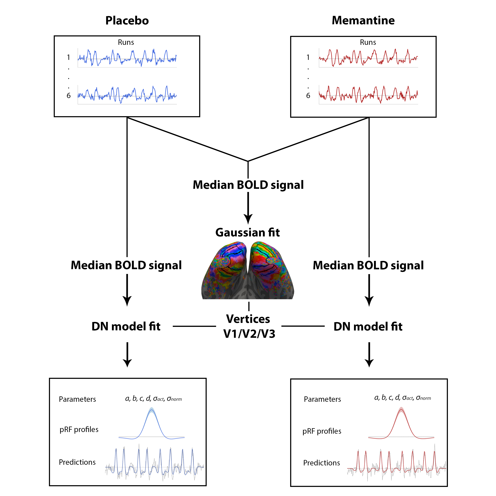

# The Effect of Memantine on pRF Characteristics in V1

This repository includes the scripts for data analysis used for my Neuroscience MSc thesis, which I wrote as part of my internship at the Spinoza Centre for Neuroimaging in Amsterdam. The project investigated the effects of the NMDA-R antagonist memantine on responses in ultra-high-field-fMRI population receptive field (pRF) characteristics in the primary visual cortex (V1) using the workflow visualized below.

## Repository Structure

The scripts included in this repository are divided into different folders:

### ROIdrawing
This folder includes scripts that were used to draw and visualize ROIs based on the Gaussian fits on the data from the two experimental conditions pooled together.

### Fitting
This folder includes scripts that were used to perform DN model fitting on the data from each condition separately using the Snellius supercomputing cluster.

### Analysis
This folder contains all the scripts that were used to perform subsequent analysis on the fits, including the analyses used in the thesis.

## Requirements

Preprocessing of the fMRI data was done using in-house Spinoza pipelines, implemented using the `linescanning` repository. Scripts in this repository start from the preprocessed data. Analysis and fitting scripts used in this repository require prior installation of the following packages and software:

- `prfpy` ([link](https://github.com/VU-Cog-Sci/prfpy))
- `linescanning` ([link](https://github.com/gjheij/linescanning))
- `pycortex` (1.3.0)
- `nibabel` (4.0.1)
- `freeview` (version 7.3.2, part of `Freesurfer`)

The spinoza_setup file contains the necessary information to link the packages to the environment used in the Spinoza server. 

## Usage
Each folder contains instructions on how to run the scripts. Please refer to the README files within each folder for specific usage instructions.

## Contact
For any questions or issues, please contact Maartje de Jong at m.dejong@spinozacentre.nl.
